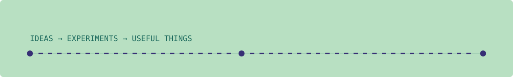
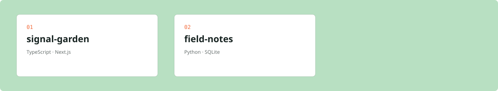

# Hey, I'm Maya Okafor 👋

> I make thoughtful tools for noisy problems.

Product engineer exploring the space between useful software, good questions, and a little bit of magic.

📍 Lagos, Nigeria · [GitHub](https://github.com/maya-builds)

## A few signals

## Things I'm building

### 1. signal-garden

A tiny observability layer for calm, useful software.

**TypeScript · Next.js**

### 2. field-notes

A searchable notebook for ideas that want to become real.

**Python · SQLite**

## Contribution trail

## Find me

[GitHub](https://github.com/maya-builds) · [LinkedIn](https://linkedin.com/in/maya-builds) · hello@example.com

